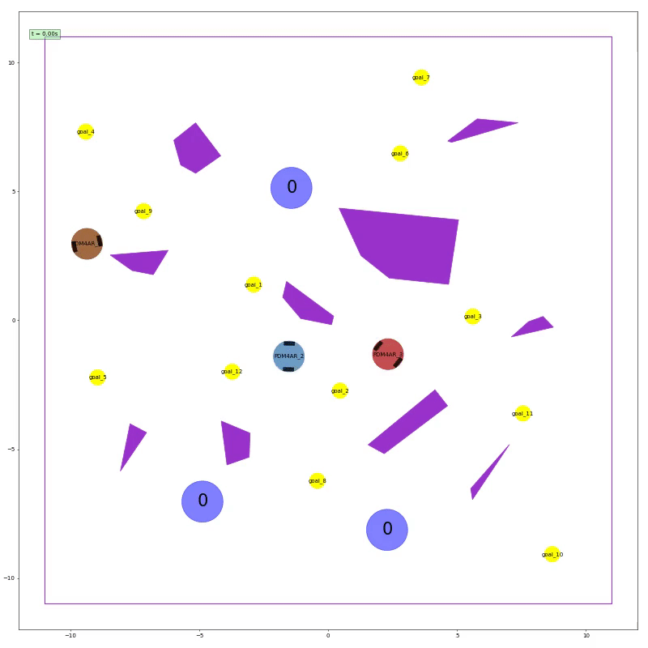
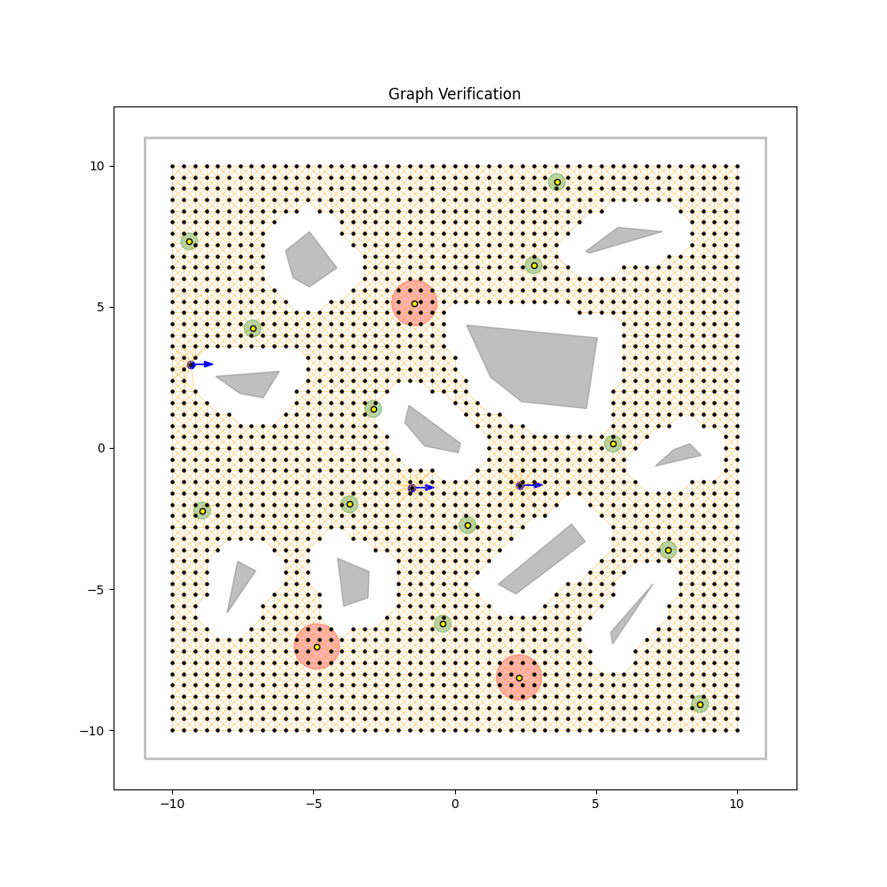
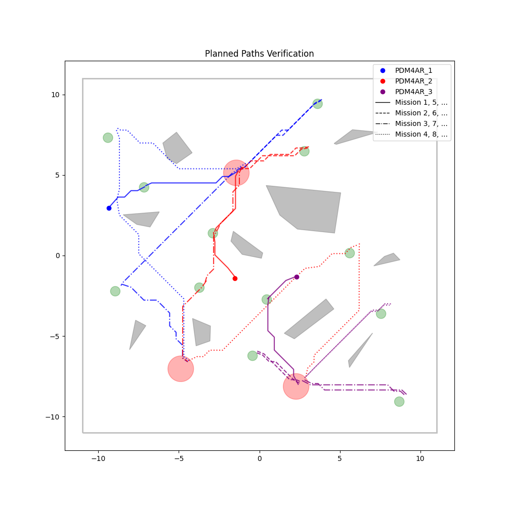
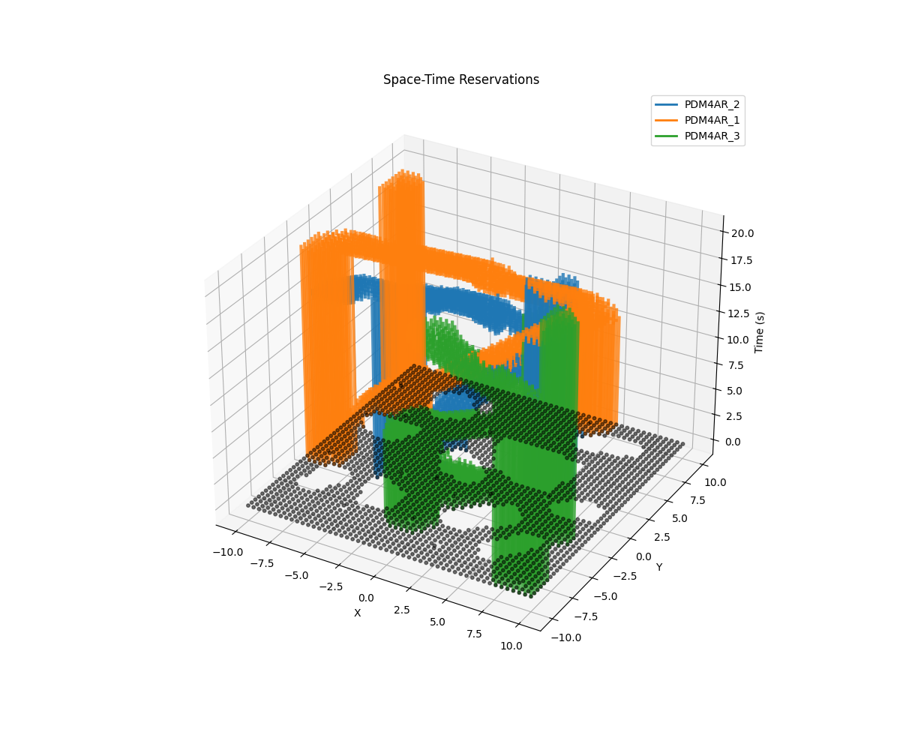
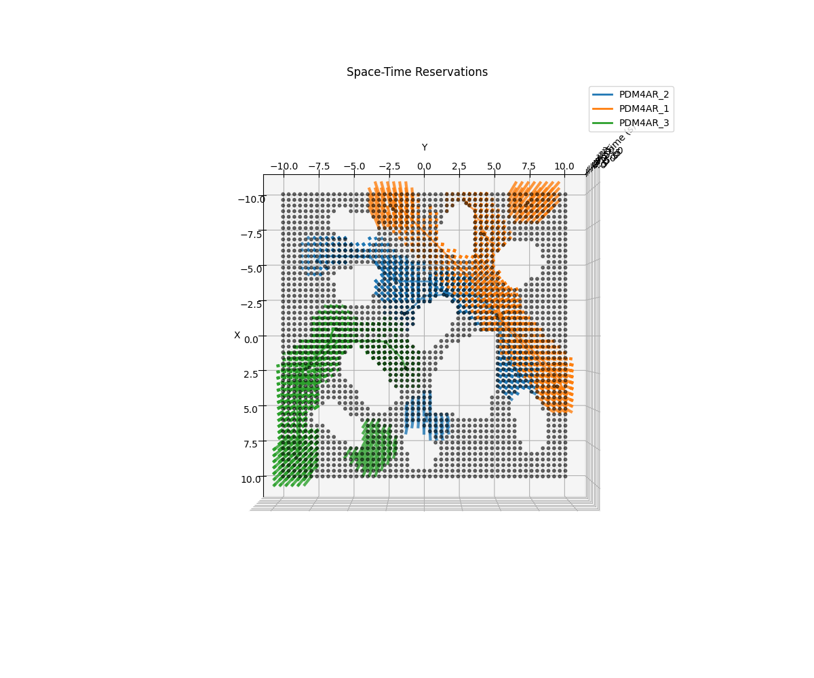
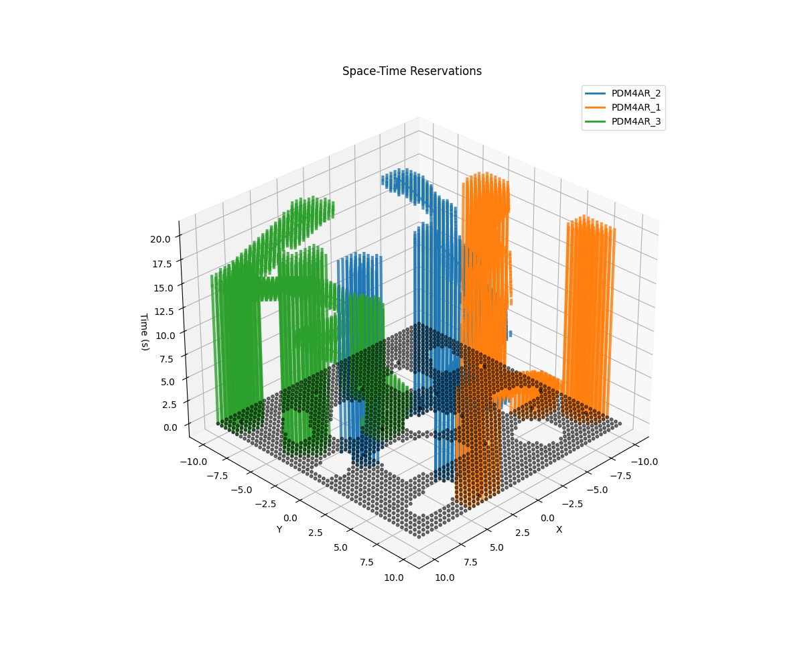

# Multi-Agent Goal Collection Planner

This repository contains our implementation of the final project for the [**Planning and Decision Making for Autonomous Robots (PDM4AR)**](https://idsc.ethz.ch/education/lectures/PDM4AR.html) course at **ETH Zurich** by **Prof. Emilio Frazzoli**.

The project implements a multi-robot coordination system for autonomous robots tasked with collecting items from distributed locations and delivering them to collection points. The system efficiently assigns goals to multiple differential-drive robots while generating collision-free paths through a hierarchical planning approach.

## Visualization

### Simulation


*Three differential-drive robots coordinating to collect items from 12 goals and deliver to 3 collection points.*

### Planning Results
<table>
<tr>
<td width="50%">

<p align="center"><em>Environment roadmap with occupancy grid</em></p>
</td>
<td width="50%">

<p align="center"><em>Global task assignment and routing</em></p>
</td>
</tr>
</table>

### 3D Space-Time Reservations

#### Animated 360° View


*Rotating 3D visualization of space-time reservations. The Z-axis represents time, and vertical colored lines show when agents reserve nodes to prevent conflicts.*

#### Static Views
<table>
<tr>
<td width="33%">

<p align="center"><em>Default view</em></p>
</td>
<td width="33%">

<p align="center"><em>Top view</em></p>
</td>
<td width="33%">

<p align="center"><em>45° rotation</em></p>
</td>
</tr>
</table>

*Space-time conflict resolution showing how agents reserve nodes over time (Z-axis = time). Each colored vertical line represents a node reservation by an agent.*

## Algorithm

The core planning framework combines **hierarchical task assignment** with **space-time conflict resolution** to coordinate multiple robots efficiently collecting and delivering items.

### Problem Formulation

The multi-agent goal collection problem can be formulated as a **Vehicle Routing Problem (VRP)** with:
- Multiple heterogeneous collection points (capacity constraints)
- Dynamic obstacle avoidance (space-time constraints)
- Differential-drive kinematic constraints
- Real-time replanning capabilities

### Solution Approach

Our solution employs a **hierarchical planning architecture** that decomposes the complex multi-agent problem into manageable subproblems:

#### 1. Roadmap Construction

The planner first builds a collision-free roadmap using one of three strategies:

- **Inflated Visibility Graph**: Computes visibility between waypoints while inflating obstacles by the robot's radius. Optimal for sparse environments with few obstacles.

- **Probabilistic Roadmap (PRM)**: Samples random configurations and connects feasible neighbors. Better for cluttered environments where visibility graphs become too dense.

- **Occupancy Grid**: Discretizes the space into a regular grid. Provides dense coverage but at higher computational cost.

The roadmap is pre-computed with all-pairs shortest paths, enabling fast distance queries during optimization.

#### 2. Task Assignment & Sequencing

The system selects an appropriate solver based on fleet size:

**MILP Solver (1-2 agents)**: Formulates the assignment as a Mixed Integer Linear Program:
- Decision variables: Binary assignment of goals to agents and visit order
- Objective: Minimize total travel distance + delivery time
- Constraints: Each goal visited exactly once, collection point capacity limits
- Solved using PuLP with CBC/GLPK backend

**Regret-Based Insertion (3-8 agents)**: A constructive heuristic that:
1. Iteratively selects the goal with highest "regret" (difference between best and second-best assignment cost)
2. Inserts it into the route where it causes minimum cost increase
3. Applies local refinement (2-opt, relocate) to improve solution quality
4. Runs in O(n²) time, making it suitable for medium-sized problems

**Iterative Greedy (9+ agents)**: Scales to large fleets by:
1. Greedily assigning each goal to the agent with minimum incremental cost
2. Balancing load across agents to prevent bottlenecks
3. Trading optimality for computational speed

#### 3. Space-Time Conflict Resolution

Once tasks are assigned, the planner generates collision-free execution plans:

**Reservation Table System**: Maintains a 3D space-time map of reserved locations. When an agent plans a path:
1. Queries the roadmap for a geometric path using A*
2. Checks the reservation table for conflicts at each timestep
3. If conflicts exist, either:
   - Inserts wait actions at safe locations
   - Re-routes around the conflict
   - Adjusts priority and replans

**Priority Management**: Agents are prioritized based on:
- Distance to next goal (closer agents get higher priority)
- Number of remaining goals (busier agents prioritized)
- Dynamic re-prioritization when deadlocks are detected

**Two-Layer Safety System**:
- **Layer 1**: Masks goal locations currently being approached by other agents to prevent conflicts at destinations
- **Layer 2**: Space-time reservations for path segments to avoid mid-path collisions

#### 4. Trajectory Generation & Control

The planner converts discrete waypoint paths into executable trajectories:

1. **Path Converter**: Transforms geometric paths into command sequences:
   - Forward/backward motion commands
   - Turn-in-place rotations to satisfy heading constraints
   - Smooth transitions between segments

2. **Simple Controller**: Tracks the planned trajectory using:
   - Differential-drive kinematics (v, ω) → (ω_left, ω_right)
   - Velocity/acceleration limits enforcement
   - Real-time command generation at 10 Hz

### Key Innovations

- **Adaptive Solver Selection**: Automatically switches between MILP, regret-based, and greedy methods based on problem size
- **Incremental Planning**: Goals are executed sequentially, allowing dynamic re-optimization as new information arrives
- **Conflict-Aware Parking**: After completing all tasks, agents park at non-interfering locations to avoid blocking future operations

## Codebase Structure

The project is organized into modular components:

* **`src/goal_collect/`**: Contains the multi-agent planner implementation.
  
  * `planner/planner.py`: The core **hierarchical planning** framework. Orchestrates task assignment and conflict resolution.
  
  * `planner/milp.py`: **MILP solver** for optimal goal assignment.
  
  * `planner/regret_insertion.py`: **Regret-based heuristic** for efficient task assignment.
  
  * `planner/conflicts.py`: **Space-time conflict resolution** with reservation tables.
  
  * `planner/graph.py`: Roadmap construction using visibility graphs, PRM, or occupancy grids.
  
  * `agent.py`: Agent interface that coordinates planning and control.

* **`src/scenarios/`**: Scenario configurations.
  
  * `config_*.yaml`: Test scenarios with varying numbers of agents, goals, and obstacles.

* **`src/evaluation/`**: Performance metrics and evaluation framework.

* **`src/main.py`**: The entry point for executing simulations.

## Running the Simulation

### Using Dev Container

1. **Open in VS Code**:
   - Install the "Dev Containers" extension
   - Click "Reopen in Container" when prompted
   
2. **Run the simulation**:
   ```bash
   make run
   ```
   The results will be saved in the `out/` directory.

### Local Development

1. **Install dependencies**:
   ```bash
   poetry install
   ```

2. **Run the simulation**:
   ```bash
   poetry run python run.py
   ```
   
3. **Run specific scenarios**:
   ```bash
   poetry run python src/main.py --scenario config_1.yaml
   poetry run python src/main.py --all-scenarios
   ```

## Configuration

Scenario configurations in `src/scenarios/` define:
- Agent starting positions
- Goal locations  
- Collection points
- Static obstacles

Planner parameters in `src/goal_collect/config.py` control:
- Graph construction method (visibility graph, PRM, or occupancy grid)
- Solver selection (MILP, regret-based, or greedy)
- Visualization and debug options
